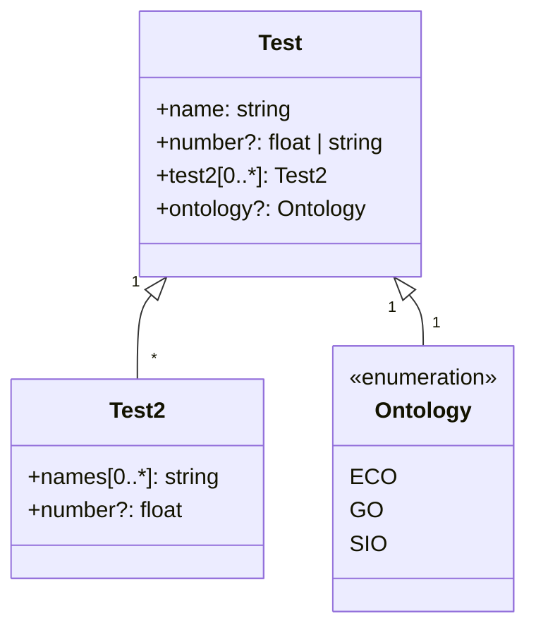

```mermaid
classDiagram
    %% Class definitions with attributes
    class Test {
        +name: string
        +number?: float | string
        +test2[0..*]: Test2
        +ontology?: Ontology
    }

    class Test2 {
        +names[0..*]: string
        +number?: float
    }

    %% Enum definitions
    class Ontology {
        <<enumeration>>
        ECO
        GO
        SIO
    }

    %% Relationships
    Test "1" <|-- "*" Test2
    Test "1" <|-- "1" Ontology
```