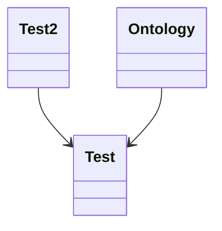

# This is a test schema

This schema is used to test the generation of documentation. It includes a primary schema, `Test`, and a secondary schema, `Test2`. The `Test` schema contains a reference to an enumeration, `Ontology`. The schema is designed to capture various attributes of a test, including its name, numerical identifier, a nested array of test2 objects, and an ontology reference.

- This is a test
  - list to make sure
  - that everything
  - is working
- So
  - please ignore
  - this section



### Test

The `Test` schema defines the primary structure for the test entity. It contains multiple properties that capture various attributes of a test, including its name, numerical identifier, a nested array of test2 objects, and an ontology reference.

- __name__
  - Type: string
  - Term: schema:hello
  - XML: @name
- number
  - Type: float
  - Term: schema:one
  - XML: @number
- test2
  - Type: Test2[]
  - Term: schema:something
  - XML: SomeTest2
- ontology
  - Type: Ontology

## Some additional docs

Some additional documentation can be added here.

- This is a test
  - list to make sure
  - that everything
  - is working

### Test2

The `Test2` schema represents a secondary structure used within the primary `Test` schema. It is designed to hold an array of strings for names, a numerical value with a specified minimum, and other nested properties.

- names
  - Type: string[]
  - Term: schema:hello
  - XML: name
- number
  - Type: float
  - Term: schema:one
  - XML: @number
  - Minimum: 0

## Enumerations

### Ontology

The `Ontology` enumeration provides endpoints for different types of sequences used within the schema. It includes references to gene ontology, semantic science ontology, and evidence ontology.

```
GO = "https://amigo.geneontology.org/amigo/term/"
SIO = "http://semanticscience.org/resource/"
ECO = "https://www.evidenceontology.org/term/"
```
